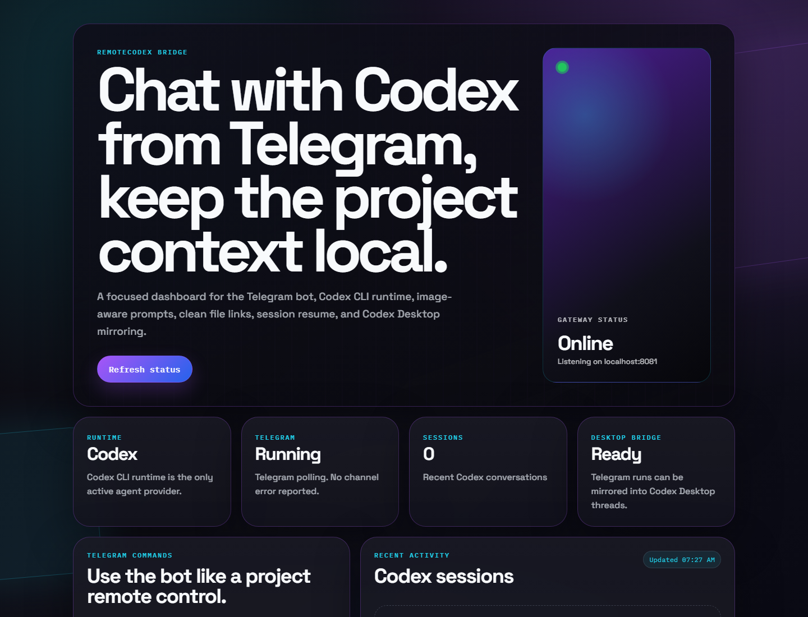

# RemoteCodex

A focused Telegram bridge for controlling Codex inside a local project folder from your phone. RemoteCodex keeps the stack intentionally small: Codex CLI, Telegram, image-aware prompts, session resume, clean replies, and optional Codex Desktop mirroring.



## Why RemoteCodex

RemoteCodex is for the tiny but powerful workflow of messaging a Telegram bot and having Codex work in the exact project folder you choose. The dashboard is deliberately simple: a dark RemoteCodex control panel showing gateway health, Telegram status, Codex runtime status, and recent sessions.

## Features

- Codex-only runtime: Telegram sessions are routed to Codex CLI.
- Project-folder binding: run Codex inside a specific workspace such as `C:\LinkTreeZakwan`.
- Telegram commands: use plain messages, `/new`, `/sessions`, `/resume`, and `/cancel`.
- Image prompts: Telegram photos are downloaded locally and forwarded to Codex as image inputs.
- Clean replies: local file references are formatted as `file.ext (line N)` instead of noisy full Windows paths.
- Stable streaming: progress is sent in order, duplicate final replies are suppressed, and cancelled runs ignore late output.
- Session resume: list recent sessions and continue a specific Codex conversation.
- Codex Desktop bridge: Telegram-started sessions can be mirrored into Codex Desktop-visible threads.
- Windows service scripts: start, stop, supervise, and optionally autostart the gateway.

## Quick Start

Requirements:

- Node.js 24 or newer
- Codex CLI installed and logged in
- A Telegram bot token from BotFather

Install dependencies:

```powershell
npm install
```

Configure Telegram for a project folder:

```powershell
scripts\configure-telegram.cmd -BotToken <telegram-bot-token> -WorkingDirectory C:\YourProject
```

Example:

```powershell
scripts\configure-telegram.cmd -BotToken <telegram-bot-token> -WorkingDirectory C:\LinkTreeZakwan
```

Start the gateway in the background:

```powershell
scripts\start-remotecodex.cmd -Background
```

Open the dashboard:

```text
http://localhost:8081
```

Stop the gateway:

```powershell
scripts\stop-remotecodex.cmd
```

## Telegram Commands

- `/new <task>` starts a fresh Codex session.
- Plain messages continue the active session.
- `/sessions` lists resumable sessions.
- `/resume latest <task>` continues the newest session.
- `/resume <session-id> <task>` continues a specific session.
- `/cancel` cancels the active run and prevents late noisy output.

## Dashboard

The dashboard runs at `http://localhost:8081` and uses the current dark RemoteCodex theme. It shows whether the gateway is online, whether Telegram polling is configured, whether the Codex runtime is registered, and which sessions were recently created.

## Notes For Safe Publishing

Bot tokens, runtime data, logs, temporary app servers, and local session files are ignored by Git. Keep real destination links, phone numbers, and private project paths out of committed examples unless you intentionally want them public.

## Development Checks

Run syntax checks for the RemoteCodex service entry points:

```powershell
npm run check
```

## License

AGPL-3.0. RemoteCodex is a focused fork built for a Codex and Telegram workflow.
